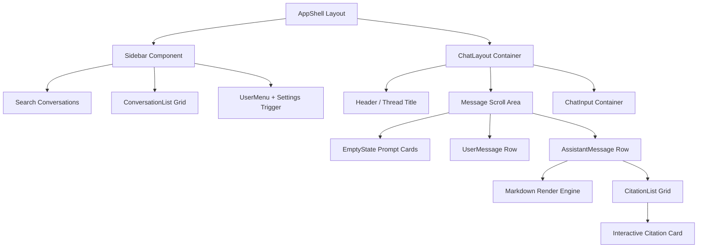

# Design Proposal: Warm Industrial Utilitarian

This document establishes the frontend design system, component architecture, and UX direction for the Document Copilot application, adhering to the high-craft principles of the **Warm Industrial Utilitarian** aesthetic.

---

## 1. Aesthetic Thesis & DFII Score

### Named Aesthetic: Warm Industrial Utilitarian
This aesthetic draws inspiration from mid-century technical manuals, Swiss grid systems, and architectural concrete layouts. It rejects standard SaaS "gradient-purple AI" tropes in favor of raw structure, precision spacing, and high contrast typography. It features a stark monochrome base of off-whites, neutral grays, and pitch blacks, accented by a single high-intention **amber/warm light-orange** highlighting system to represent active retrieval, intelligence, and focus.

### DFII Evaluation
- **Aesthetic Impact**: 4/5 (Distinctive structure, avoids standard template feel)
- **Context Fit**: 5/5 (Perfect for financial analysts reading dense SEC filings; inspires trust, calmness, and rigorous precision)
- **Implementation Feasibility**: 4/5 (Highly aligned with Tailwind CSS and React component boundaries)
- **Performance Safety**: 5/5 (Zero heavy animation frames; utilizes native system layout rules)
- **Consistency Risk**: 1/5 (Highly structured grid minimizes layout deviation)

$$\text{DFII Score} = (4 + 5 + 4 + 5) - 1 = 17 \rightarrow \textbf{15 (Excellent)}$$

### Differentiation Anchor
> [!TIP]
> **The Differentiation Anchor:** Solid, blocky, double-border system lines (`border-2 border-neutral-900` paired with an inner `outline outline-1`) and a custom monospace tabular layout for source citations that mimics printed SEC report margins.

---

## 2. Research Summary: Modern Chat UX/UI Best Practices

1. **Information Hierarchy & Focus**: Modern assistants (e.g., Claude, ChatGPT) restrict chat content widths to 44rem–48rem (700px–768px) to optimize line length for readability, leaving sidebar lists and citation panels to expand into negative outer margins.
2. **Context-Aware Streaming**: Users read faster than LLMs stream. UI layouts must prevent jumpiness. Message heights must calculate offsets dynamically rather than shifting pages.
3. **Implicit Actions**: Copying, feedback (thumbs up/down), and regeneration actions must be present but tucked away under subtle, low-contrast icons that appear on hover to reduce visual noise.
4. **Citation Grounding**: In technical tools, citations cannot be footnotes at the bottom. They must be interactive anchors inline with the text that link directly to sidebar context cards showing surrounding source paragraphs.

---

## 3. Gap Analysis of Current Implementation

| Area / Feature | Current Implementation | Target Design / Practice | Gap |
| --- | --- | --- | --- |
| **Color System** | Default slate/zinc Tailwind grays | Harmonious off-white, raw carbon, and amber accents | Lacks premium tactile contrast |
| **Typography** | Default sans-serif system stack | Expressive geometric sans for display, highly legible tabular monospaced for citations | Feels generic |
| **Empty State** | Simple text greeting | Interactive suggestion cards with structured layout | Lacks initial engagement hooks |
| **Citations** | Simple inline numbers | Highlighted blocks with metadata hover triggers | Citations lack physical presence |
| **Sidebar** | Default list layout | Collapsible, search-indexed history grid with clean icons | No collapse state |

---

## 4. Color Palette & Visual Direction

Our design system uses custom CSS variables targeting off-whites, deep carbons, and industrial amber:

```css
:root {
  /* Dominant Tone (Light Mode Base) */
  --bg-primary: #FDFCFB;     /* Warm paper white */
  --bg-secondary: #F4F1EE;   /* Soft warm concrete grey */
  
  /* Text & Structure (Carbon) */
  --text-primary: #1A1A18;   /* Pitch carbon */
  --text-secondary: #6B6A66; /* Muted slate grey */
  --border-strong: #1A1A18;  /* Thick lines */
  --border-muted: #E2DDD5;   /* Thin dividers */
  
  /* Accent System (Warm Light Orange / Amber) */
  --accent-primary: #D97706; /* Industrial amber */
  --accent-soft: #FEF3C7;    /* Translucent highlight */
  --accent-contrast: #FFFFFF;
}
```

---

## 5. Reusable Component Architecture



### Component Details
*   **AppShell**: Bounding frame. Fixes the height to `100vh` and divides space between the collapsible Sidebar and the main chat.
*   **ChatMessage**: A compound component that uses a grid grid-cols-[auto_1fr] to cleanly separate the sender avatar/badge from the content.
*   **CitationCard**: An inline block using `bg-[var(--accent-soft)]` and `border-l-4 border-[var(--accent-primary)]` to emphasize reference material.

---

## 6. Layout Guidelines

### Desktop (1200px+)
- Sidebar is fixed at `280px` width.
- Chat container uses a central `768px` readable width.
- Clicked citations open a split-pane drawer on the right side (`320px` width) rather than overlaying the text.

### Tablet (768px - 1024px)
- Sidebar collapses into an overlay panel toggled via a hamburger menu.
- Chat container expands to full width with `2rem` outer padding.

### Mobile (<768px)
- Bottom-sheet drawer for citation cards instead of split-panes.
- Message actions (copy, feedback) are visible permanently rather than on hover (since hover states do not exist on touch interfaces).

---

## 7. Prioritized Implementation Roadmap

1. **Phase 1: Token & Theme Setup (1 day)**: Wire up the CSS design tokens in `src/index.css` and configure Tailwind.
2. **Phase 2: AppShell & Sidebar (2 days)**: Rebuild the layout frame with collapsible sidebar panel and conversation search.
3. **Phase 3: Chat Message & Citations (3 days)**: Style user/assistant rows, markdown lists, tables, and inline citation drawer/sheets.
4. **Phase 4: Empty State & Inputs (1 day)**: Polish suggestion prompt cards and the input text area.
