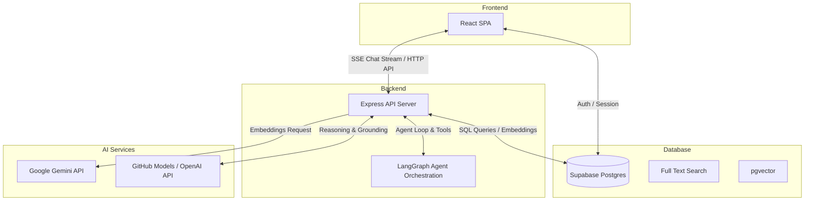

# Architecture

FinDoc AI is an internal research assistant for analysts who need grounded answers from a curated SEC filing corpus. Every answer must be backed by retrieved source passages.

This architecture uses a thin React client and a Node.js backend.

## High-level shape

- `frontend/`: Vite + React SPA
- `backend/`: Node.js + JavaScript/TypeScript + Express API
- `supabase`: auth, Postgres, `pgvector`
- `openai`: generation and embeddings

## Principles

- Keep the browser thin.
- Keep the backend authoritative for retrieval, grounding, streaming, and writes.
- Keep auth in Supabase.
- Keep migrations as backend-owned SQL files.
- Keep the app full JS/TS unless a real blocker exists.
- Use LangChain.js and LangGraph.js for the backend agent layer.

## Stack

Backend:

- Node.js 20+
- JavaScript/TypeScript
- Express
- LangChain.js
- LangGraph.js
- OpenAI Node SDK
- `@supabase/supabase-js`
- `pg`
- SQL migrations

Frontend:

- Vite
- React
- TypeScript
- React Router
- `@supabase/supabase-js`

Persistence:

- Supabase Postgres
- `pgvector`
- Postgres full-text search

## Request flow

1. User signs in with Supabase Auth in the SPA.
2. Frontend stores the session with `@supabase/supabase-js`.
3. Frontend sends `Authorization: Bearer <token>` to the backend.
4. Backend verifies the token with Supabase.
5. Backend retrieves ranked chunks from Supabase/Postgres.
6. Backend runs the LangGraph agent with grounded context and retrieval tools.
7. Backend calls OpenAI through LangChain/OpenAI integrations.
8. Backend streams the answer back to the SPA.
9. Backend persists chat messages and citations.

## Frontend rules

- Do not call OpenAI from the browser.
- Do not expose the service role key.
- Route all privileged work through the backend API.
- Keep API access in shared client helpers.

## Backend rules

- Verify auth at the HTTP boundary.
- Keep retrieval and ranking in focused modules.
- Use SQL and Postgres features directly where that stays simpler than an ORM.
- Keep agent state and tool boundaries in LangChain/LangGraph modules.
- Stream partial assistant output to the client.
- Persist threads, messages, and citations in Supabase.

## Retrieval

Use hybrid retrieval:

1. generate an embedding for the query
2. run semantic search over `document_chunks.embedding`
3. run full-text search over `document_chunks.search_vector`
4. fuse the ranked results in backend JS/TS
5. fetch the final chunks and surrounding context

## Configuration

Backend config lives in `backend/src/config.js` or `backend/src/config.ts`.
Frontend config lives in `frontend/src/lib/env.ts`.

Required env:

- `SUPABASE_URL`
- `SUPABASE_ANON_KEY`
- `SUPABASE_SERVICE_ROLE_KEY`
- `DATABASE_URL`
- `OPENAI_API_KEY`
- `ALLOWED_ORIGINS`
- `VITE_API_BASE_URL`

## Deployment

- Frontend: static Vite build
- Backend: Express service on Railway
- Database/Auth: hosted Supabase

## Implementation order

1. Standardize the backend on the Node.js service already in `backend/src/`.
2. Add Supabase auth and shared config modules.
3. Add SQL migrations and base schema.
4. Add chat APIs and streaming.
5. Add LangChain.js and LangGraph.js orchestration.
6. Add ingestion, chunking, embeddings, and retrieval.
7. Remove the legacy Python backend modules under `backend/app/`.
8. Add citation UI and analyst-facing polish.
